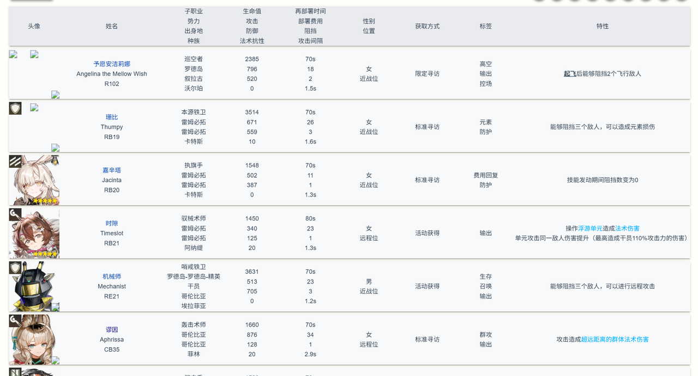
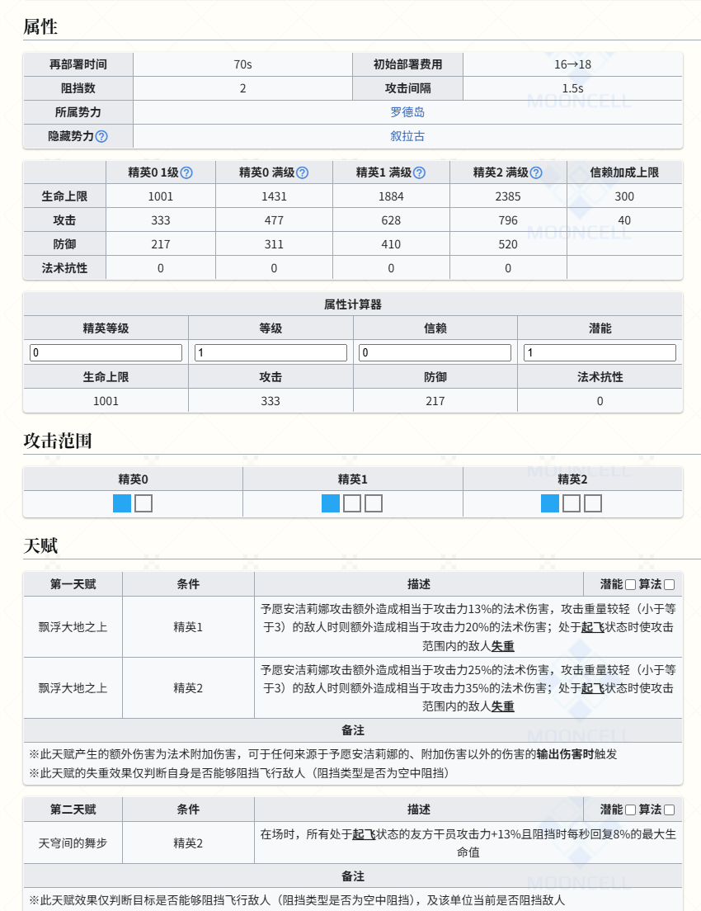
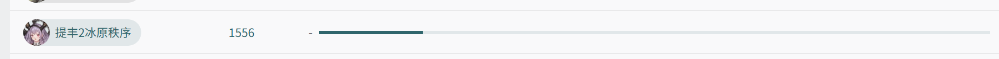
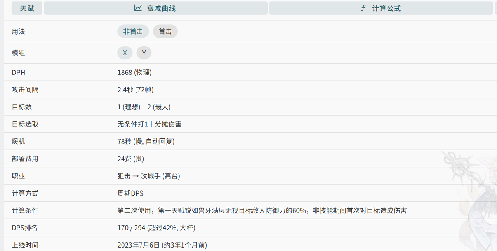
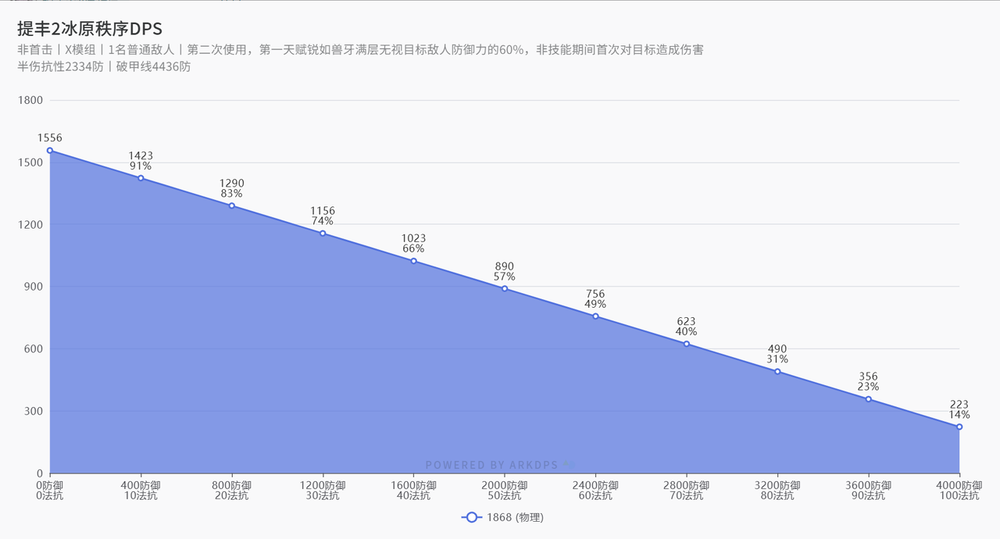
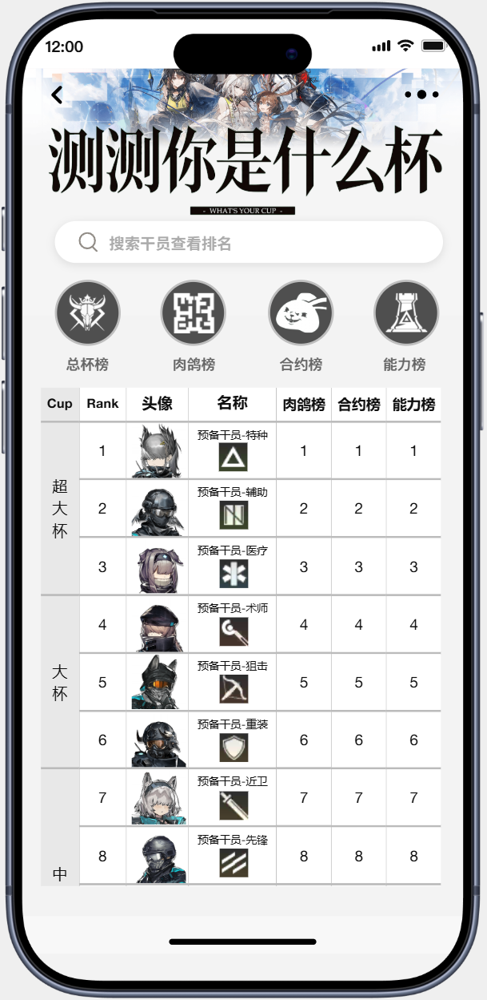
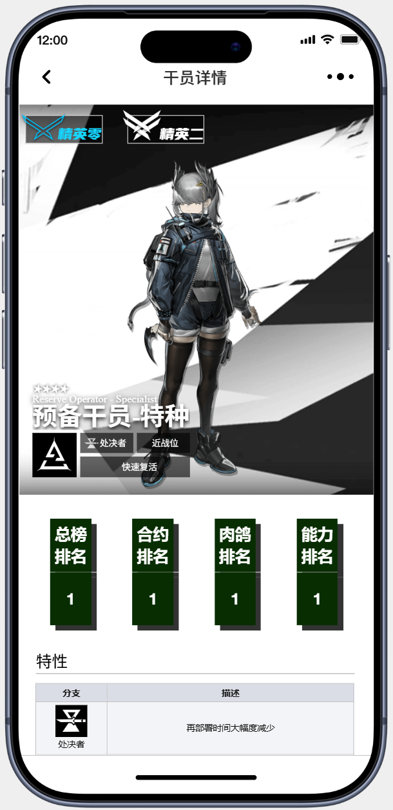
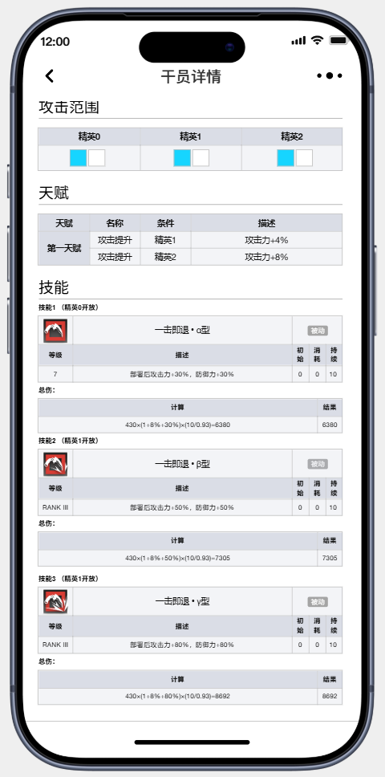

# 《杯级计算器》产品需求文档 (PRD)

## 一、版本说明

### 版本信息

|当前版本|修订日期|修订人|
|:-|:-|:-|
|v1.4|2026-08-03|阿星|

### 版本日志
|版本号|修订日期|修订人|修订内容|备注|
|------|--------|------|--------|--------------------|
|v1.0|2026-04-28|阿星|初版内容确定||
|v1.1|2026-05-10|阿星|新增数据管理及术语表||
|v1.2|2026-06-24|阿星|新增项目演示地址并调整了项目路径图||
|v1.3|2026-06-29|阿星|同步后端重构架构设计与任务流||
|v1.4|2026-08-03|阿星|新增需求方向，调整项目目标||

## 二、背景目标

### 竞品分析

|竞品|主要信息|关键结论|图片|
|:-|:-|:-|:-|
|PRTS|《明日方舟》非官方的开源信息网站。包含干员信息、敌人信息等多种信息，但并没有干员的伤害计算信息|PRTS主要是作为基础数据来源，缺乏具体的伤害计算和能力分析。本产品的数据可以从PRTS中提取，进行进一步的加工和展示。||
|ArkDPS|《明日方舟》非官方伤害计算网站。有严谨且多维度的干员伤害计算，并包含DPS排行和总伤显示及伤害曲线。|ArkDPS注重于伤害能力的计算和DPS排行，拥有比较严谨且全面的结论，但是缺乏多维度（例如实际应用场景）的判断。本产品可以通过引入一些舆论判断，与其提供的数据结合进行综合性质的产出。||

### 产品定位

一个针对《明日方舟》六星干员的综合分析工具。通过PRTS和ArkDPS的数据汇总，加上社交媒体上KOL的强度论断，对多维评判结果进行汇总并得出的综合强度榜单。

### 核心愿景

为玩家提供直观、准确、具备公信力的干员强度参考依据，通过数据可视化体现“断层”差距，并通过“杯级”算法突显偏科干员的优势。

### 后续迭代规划

1. **管理员审核后台**：用于审核和录入新增干员的外号。
2. **数据纠错机制**：用户可反馈数值偏差，经后台核实后修正解析逻辑。

## 三、需求范围

| 用例 | 用户故事 | 核心体验 | 优先级 | 路径图 |
|:-|:-|:-|:-|:-|
| **查看总杯级排行** | 用户需要能在应用中查看包含所有6星干员的杯级榜单，并能看到榜单的计算标准和每个干员在各个领域内的能力排行。 | 启动应用 -> 看见榜单 -> 榜单上方小字显示计算标准 -> 榜单每一行显示一位干员，从左到右依次显示杯级、排名、干员名称、干员头像、干员职业、挂机DPS/HPS排行、决战DPS/HPS排行。 | 必要 | 首页 |
| **查看子榜单排行** | 用户需要能在应用首页跳转各个单项能力排行榜单，并在上面看到所有拥有该单项能力的干员的排行。 | 启动应用 -> 从上方导航栏选择单项榜单 -> 进入单项榜单 -> 榜单每一行显示一位干员，从左到右依次显示杯级、排名、干员头像、干员名称、干员职业、该项能力的具体数值（如DPS, 总伤等）。 | 必要 | 首页 -> 子榜单 |
| **能力前10名数据可视化** | 用户需要能在能力榜单页面自由切换榜单模式和条形图模式。 | 启动应用 -> 杯级榜单 -> 能力榜单 -> 点击切换条形图 -> 展示前10名干员能力数值 | 次要 | 首页 -> 子榜单 -> 切换条形图 |
| **干员查询功能** | 用户可以在搜索页面输入干员名称或者外号查询单个干员的杯级和能力值排行。 | 启动应用 -> 点击上方搜索栏 -> 键入干员名称或外号 -> 显示搜索结果（按相关度排序），每行显示杯级、总排名、名称、头像、职业、各项能力值排行。 | 重要 | 首页 -> 搜索页 -> 搜索结果 |
| **查看干员详细能力** | 用户在总榜单应能点击干员所在的行进入干员详情页，查看干员的各项能力榜单排名和能力值信息。 | 启动应用 -> 查看榜单 -> 点击干员所在行 -> 进入干员详情页 -> 显示干员名称、完整立绘、杯级、总排名、各项能力排名、各项能力值。 | 次要 | 首页 -> 干员详情页 |

## 四、概要设计

### 项目原型

<table>
  <thead>
    <tr>
      <th>首页</th>
      <th>详情页1</th>
      <th>详情页2</th>
    </tr>
  </thead>
  <tbody>
    <tr>
      <td></td>
      <td></td>
      <td></td>
    </tr>
    <tr>
      <td colspan="3"><strong> <a href="https://modao.cc/proto/Zke7kT0Rtetazg078Xqpky/sharing?view_mode=device&screen=rbpVJCfgrLCxO9S2G">完整原型的交互及组件设计请访问此链接</a> </strong></td>
    </tr>
  </tbody>
</table>

### 功能设计及页面分布

* **首页：杯级排行榜**
  * **排行榜单流**：承载全干员杯级排行、单项子榜单（挂机榜、决战榜等）列表。
  * **可视化看板**：伤害能力子榜单前 10 名干员数据的条形图动态展示。
  * **版本更迭标识**：显示当前干员排名对比上一个版本的升降浮动（如：-1, NEW）。
* **查询：角色详情页**
  * **详情展示面板**：全方位展示干员立绘、最高杯级评价、各项能力位次及抗性对比面板。
* **历史溯源：时光机**
  * **历史快照模块**：允许用户切换并查看过往历代限定池版本更新后的历史榜单快照。

## 五、详细设计（交互、功能、逻辑）

### 榜单分类与排名依据

系统下设**能力榜**、**合约榜**和**肉鸽榜**，定义如下：

1. **能力榜**：
    * 针对角色的伤害和治疗能力，包括技能DPS、HPS、总伤、总治疗量
    * 数据来源为ArkDPS
2. **合约榜**：
    * 针对角色在危机合约的高难环境下的表现能力
    * 参考up主血狼破军每年发布的合约强度评价视频得出的全6星干员合约能力排行
    * 榜单包含排名、干员名称、头像、职业、合约战绩
3. **肉鸽榜**
    * 针对角色在集成战略的复杂环境下的综合作战能力
    * 以当前最新集成战略主题表现为主，往期集成战略有特别亮眼表现为辅
    * 暂未决定可靠的数据来源

### 评分与“杯级”算法

系统采用基于排名的**非线性加权算法**，专门针对“偏科战神”进行补偿：

* **基础分获取**：根据干员在各个子榜单中的排名换算得出。
* **加权**：若干员在任一子榜单进入**全干员前 10 名**，则该项基础得分享受高额权重，确保专项能力能大幅拉升综合排名。
* **杯级阶梯划分**：
    最终根据干员总分的整体排名百分比赋予直观标签：

    | 综合排名百分比 | 评级标签 |
    | :--- | :--- |
    | 前 10% | **超大杯 · 上** |
    | 10% - 20% | **超大杯 · 中** |
    | 20% - 30% | **超大杯 · 下** |
    | 30% - 50% | **大杯** |
    | 50% 以下 | **中杯** |

### 详细交互与表现逻辑

* **总榜子榜切换**：总榜与各个子榜位于同一页面，通过顶部导航栏切换不同组件实现榜单直接的切换
* **能力榜单形态切换**：在单项能力子榜单中，列表页主要展示完整排名与数值；在能力子榜单点击条形图切换按钮后，X轴渲染前 10 名干员头像/名称，Y轴渲染能力数值柱状图。
* **干员详细能力查看**：在榜单中点击干员名称或头像触发详情页面跳转，展示干员的技能与数据详情。

### 核心流程图

### 项目数据管理

|字段名|数据类型|字段说明|
|------|----|----------|
|character_id|String|角色的唯一ID|
|name|String|角色的官方名称|
|nickname|List(String)|角色的玩家昵称列表|
|cup_level|String|角色杯级评价|
|rank|Number(int)|角色总排名|
|auto_dps|Number(int)|角色挂机DPS|
|auto_dps_rank|Number(int)|角色挂机DPS排名|
|auto_hps|Number(int)|角色挂机HPS|
|auto_hps_rank|Number(int)|角色挂机HPS排名|
|manual_dps|Number(int)|角色决战DPS|
|manual_dps_rank|Number(int)|角色决战DPS排名|
|manual_hps|Number(int)|角色决战HPS|
|manual_hps_rank|Number(int)|角色决战HPS排名|
|manual_damage_total|Number(int)|角色决战总伤害|
|manual_damage_total_rank|Number(int)|角色决战总伤害排名|
|manual_heal_total|Number(int)|角色决战总治疗量|
|manual_heal_total_rank|Number(int)|角色决战总治疗量排名|
|update_time|Date|数据最新更新日期|

## 六、术语表

|术语|释义|
|----|----------|
|PRTS|《明日方舟》维基百科数据源|
|干员|《明日方舟》中可供玩家操控的游戏角色|
|DPS|秒均伤害（Damage Per Second）|
|HPS|秒均治疗量（Heal Per Second）|
|杯级|模仿咖啡店杯子尺寸设定的强度评判标准，由弱到强为：“中杯”，“大杯”，“超大杯”|
|挂机技能|指可以自动释放或者经过数次主动释放后可以持续时间无限的技能|
|决战技能|通常指具有高伤害，但是释放前提比较严格的技能；本榜单中所有非挂机技能均视为决战技能|
|精二满级|《明日方舟》中的角色养成标准，全称为“精英二阶段90级”，为目前游戏中单个角色的等级养成上限|
|专三|《明日方舟》中的技能养成标准，全称为“专精三级”，为目前游戏中单个技能的养成上限|
|模组|《明日方舟》中的养成模块，为角色额外附加的属性及能力强化系统，不同的角色效果均不统一|
